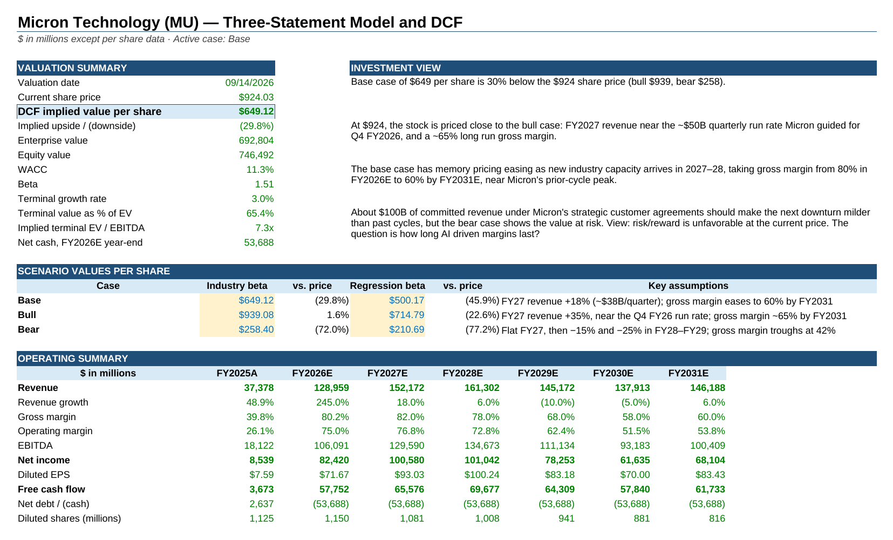

# Micron Technology (MU) — Three-Statement Model and DCF

A fully linked three statement financial model and discounted cash flow (DCF) valuation of Micron Technology. Built in Excel from SEC filings and management guidance.

**By Julian Lugo**

📊 [Excel model](Micron_MU_Three_Statement_Model_DCF.xlsx) · 📄 [PDF version (view in browser)](Micron_MU_Model.pdf)

## Valuation result

| Case | Value per share | vs. $924.03 price | Key assumptions |
|---|---|---|---|
| **Base** | **$649** | **−30%** | FY27 revenue +18%; gross margin eases from ~80% to 60% by FY2031 |
| Bull | $939 | +2% | FY27 revenue near the Q4 FY26 run rate; gross margin ~65% by FY2031 |
| Bear | $258 | −72% | Flat FY27, then a FY28–FY29 downturn; gross margin troughs at 42% |

Values use an industry bottom-up beta (1.51). Using Micron's 5-year regression beta (2.22) instead gives $500 / $715 / $211.

**Investment view:** At $924, the market is pricing in mostly the bull case. The base case assumes memory pricing eases as new industry capacity arrives in 2027–28, bringing margins back toward Micron's prior cycle peak. About $100B of committed revenue under Micron's strategic customer agreements should make the next downturn milder than past cycles. The question is how long AI driven margins last?

## What's in the model

| Tab | Contents |
|---|---|
| **Summary** | Valuation summary, investment view, scenario values, operating summary |
| **Assumptions** | Scenario switch (base/bull/bear), cost ratios, working-capital days, capex, capital returns, WACC inputs, beta build |
| **FY26 Bridge** | FY2026 estimate built from nine month actuals plus Q4 FY2026 guidance |
| **Statements** | Linked income statement, balance sheet and cash flow statement (FY2023A–FY2031E) |
| **DCF** | Unlevered free cash flow, WACC, terminal value, and WACC / growth / beta sensitivity tables |
| **Checks** | Balance sheet, cash, roll-forward, bridge and sensitivity checks (all zero) |
| **Sources** | Filings, market data and modeling simplifications |

## Key features

- **Scenario analysis:** switch between base, bull and bear cases with one input (Assumptions C62); beta method switch in C48
- **FY2026 bridge:** reported nine month results plus company guidance; model Q4 net income is within 0.5% of guidance
- **Capital returns:** buybacks return free cash flow to shareholders, with the share count rolling forward
- **Bottom-up beta:** Damodaran semiconductor industry beta relevered for Micron's capital structure
- **Sensitivity tables:** value per share across WACC, terminal growth and beta
- **Integrity checks:** balance sheet balances and cash reconciles in every year

## Key assumptions

| Input | Value | Source |
|---|---|---|
| Risk-free rate | 4.99% | 10-year Treasury, 9/14/2026 close |
| Equity risk premium | 4.23% | Damodaran implied ERP, start of 2026 |
| Beta | 1.51 | Damodaran US semiconductor unlevered beta (1.50), relevered |
| WACC | 11.3% | Calculated |
| Terminal growth | 3.0% | Assumption |
| Tax rate | 15% | Near 9M FY2026 effective rate |

## Sources

- Micron FY2024 and FY2025 Form 10-K
- Micron Q3 FY2026 Form 10-Q, earnings release, earnings deck and prepared remarks (June 2026)
- Market data: Yahoo Finance / Nasdaq, FRED (DGS10)
- Aswath Damodaran (NYU Stern): implied equity risk premium and industry betas

Full sources linked in the Sources tab.

## Notes

- Figures in $ millions except per-share data. Micron's fiscal year ends in late August / early September.
- FY2026 is an estimate; Micron reports FY2026 results on September 30, 2026.
- This is an educational project, not investment advice.
